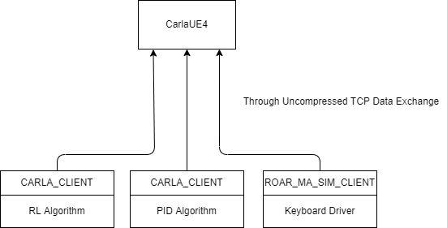
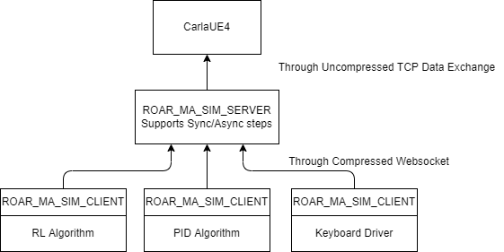

# Server Design Document

> Author: [Yunhao Cao](https://quantumcookie.xyz)

This is the design document for `ROAR-MA-SIM-SERVER`. The name of the system `ROAR-MA-SIM-SERVER` stands for `Robot Autonomous Open Racing - Multi Agent Simulation Server`.

## Overview for Previous Architecture

The previous architecture for how we used CarlaUE4 to simulate autonomous racing environment is demonstrated as follows. 



There are several downsides of the previous architecture:

1. Multi-agent simulation is not implemented in code.
   1. In theory carla supports multi-agent simulation out of the box, but **even if we had implemented it we would only have the option to run the world asynchronously**, which is not ideal for RL learning algorithms.
   2. Why? Think about in synchronous mode, if multiple agents connect to the Carla server, which agent should be the one to issue the tick command?
2. Data transfer is **extremely inefficient**
   1. Aaron Xie in the previous summer used port-forwarding to establish the ROAR(Carla) server in our lab for other groups who do not have a GPU. But the problem here is that carla's communication protocol is not compressed at all and each tick would take a long time for the sockets to transfer the rendered sensor data. (A 1280x1024 frame takes 91Mb/s for one camera sensor!) => Also exposing the carla port means anyone can configure the `world` object in carla and tick the world as they like.
   2. See [Carla/#2128](https://github.com/carla-simulator/carla/issues/2128)

## Proposed Architecture



The job of the server is to provide a simulation environment (through the use of websocket interfaces) for remote agents to connect to and interact with. 

How we aim to solve the previous problems and impove development experience:

1. The `ROAR_MA_SIM_SERVER` will be launched on the same machine(or same local network) as the `CarlaUE4` server, and therefore the uncompressed TCP data exchange basically turns into a local memory copy (with a little bit of OS overhead).
2. Support for Asynchronous/Synchronous mode.
   1. I will describe how the proposed structure intend to handle each case in the following sections.
3. Possibility of deploying over CDN
   1. CDN providers like Cloudflare supports Websocket proxying, which means we can deploy the server in our lab but hide our true IP and SSH communications from the public internet.
4. Rendering of the simulated environment (off-screen rgb frames)
   1. Since we will need to pass the image to the clients, it means that off-screen rendering is automatically supported.
   2. Thus with rendered frames we can try to stream future ROAR competitions to bring more excitements to the audience.
   3. It also means in RL we will be able to upload video clips to wandb for different training steps.

### Synchronous Mode

At server startup, the server will initialize carla client and listen to incoming websocket connections. It also starts a game loop.

```python
connected_clients = []

def ws_handler(ws,init_msg):
    connected_clients.append(ws)
    world.initialize_agent(init_msg)

def main(_):
    client = carla.Client("localhost", 2000)
    world = client.get_world()
    world.set_synchronous_mode(True) #Set to synchronous mode
    wss = WebSocketServer(handler = ws_handler)
    # ...
    while True:
        # ...
        actions = []
        for client in connected_clients:
            observations = world.get_observation()
            await client.send(observations)
        for client in connected_clients:
            next_action = await client.recieve_next_action(timeout = 0.2)
            if next_action is not None:
                actions.append(next_action)
            else:
                kick_client(client)
        for action in actions:
            world.apply_action(action)
        world.tick()
```

Note that the above is a pseudo-code, and the actual implementation will be more complicated. The main idea is that the server will wait for all clients to send their next actions before ticking the world.

We can design more clever kicking mechanism to prevent clients from blocking the server.

Also, instead of kicking the client, maybe we can just tell the client how many ticks they have missed and each time they miss a tick, we assume that they apply zero action.

### Asynchronous Mode

In asynchronous mode, the server will not wait for all clients to send their next actions before ticking the world. Instead, the actions sent by the clients will be applied to the world asap after the server receives them. Also to prevent network traffic from overwhelming the server, the observations sent by the server will be throttled.


```python
connected_clients = []

def action_handler(ws,action):
    world.apply_action(action)
    if not_throttled:
        observation = world.get_observation(ws)
        ws.send(observation)
    elif too_much_throttled:
        kick_client(ws)


def ws_handler(ws,init_msg):
    connected_clients.append(ws)
    world.initialize_agent(init_msg)
    ws.subscribe(action_handler)

def main(_):
    client = carla.Client("localhost", 2000)
    world = client.get_world()
    world.set_synchronous_mode(False) #Set to asynchronous mode
    wss = WebSocketServer(handler = ws_handler)
    # ...
    await wss.spin() #Continue to listen to incoming connections and messages
```

This is also a pseudo-code, and the actual implementation will be more complicated. 

### Challenges

To send/receive actions and observations, we need to find a way to serialize objects in python. Because the CARLA API is a cpython extension, I don't think we can just use `json.dump` and `json.load` to serialize the objects. We will see how to proceed about this...

### Code Sharing

In the above pseudo-codes, we can see that we are using the same `world` object in both synchronous and asynchronous mode. This means that we can share the same code for both modes => just need to handle websocket connections differently based on the running mode of `ROAR_MA_SIM_SERVER`.